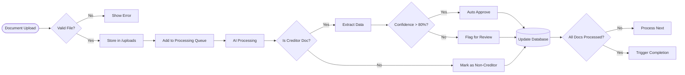
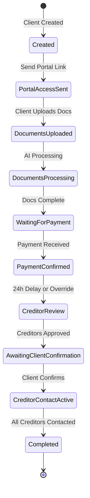
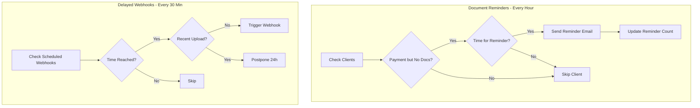
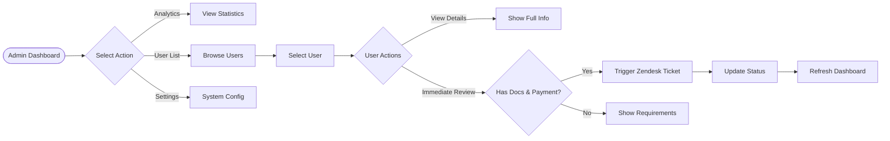
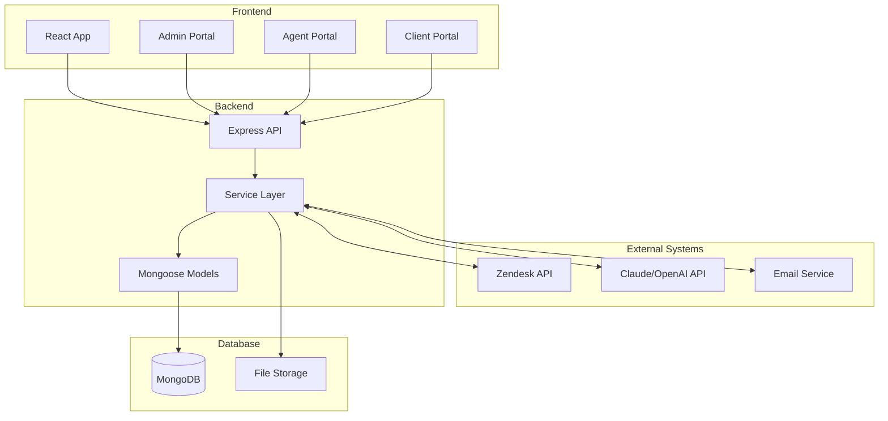
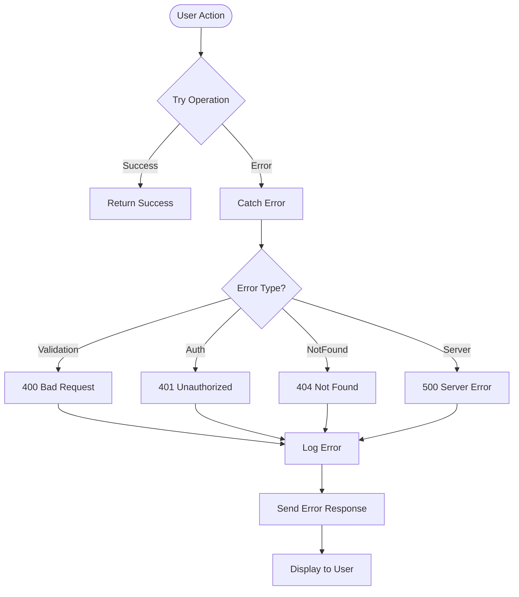
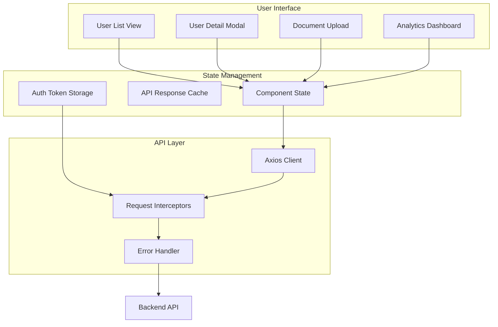

# Mandanten-Portal System Flowchart

## 🔄 Main System Flow

```mermaid
graph TB
    Start([Client Insolvency Case Starts]) --> CreateClient[Agent Creates Client in Zendesk]
    CreateClient --> WebhookReceived[Webhook: Client Created]
    
    WebhookReceived --> StoreDB[(Store in MongoDB)]
    StoreDB --> GeneratePortal[Generate Portal Access]
    GeneratePortal --> SendEmail[Send Portal Link Email]
    
    SendEmail --> ClientLogin{Client Logs In?}
    ClientLogin -->|Yes| UploadDocs[Client Uploads Documents]
    ClientLogin -->|No| WaitForLogin[Wait for Login]
    WaitForLogin --> SendEmail
    
    UploadDocs --> AIProcess[AI Document Processing]
    AIProcess --> ExtractCreditors[Extract Creditor Data]
    
    ExtractCreditors --> CheckPayment{First Payment Received?}
    CheckPayment -->|No| WaitPayment[Wait for Payment]
    CheckPayment -->|Yes| Schedule24h[Schedule 24h Delay]
    
    WaitPayment --> PaymentWebhook[Payment Confirmation Webhook]
    PaymentWebhook --> Schedule24h
    
    Schedule24h --> Wait24h{24 Hours Passed?}
    Wait24h -->|No| AdminOverride{Admin Override?}
    AdminOverride -->|Yes| CreateTicket
    AdminOverride -->|No| Wait24h
    Wait24h -->|Yes| CreateTicket[Create Zendesk Review Ticket]
    
    CreateTicket --> ReviewType{Review Type?}
    ReviewType -->|Auto Approved| ClientConfirm[Await Client Confirmation]
    ReviewType -->|Manual Review| AgentReview[Agent Reviews Creditors]
    ReviewType -->|No Creditors| ManualCheck[Manual Document Check]
    
    AgentReview --> ApproveCreditors[Agent Approves List]
    ManualCheck --> ApproveCreditors
    ApproveCreditors --> ClientConfirm
    
    ClientConfirm --> ClientConfirmed{Client Confirmed?}
    ClientConfirmed -->|Yes| StartContact[Start Creditor Contact]
    ClientConfirmed -->|No| FollowUp[Follow Up with Client]
    FollowUp --> ClientConfirm
    
    StartContact --> ContactCreditors[Send Emails to Creditors]
    ContactCreditors --> TrackResponses[Track Responses]
    TrackResponses --> GeneratePlan[Generate Settlement Plan]
    GeneratePlan --> Complete([Case Complete])
```

## 📊 Document Processing Flow

## 🔐 Authentication Flows

```mermaid
graph TD
    subgraph Client Portal
        CStart([Client Start]) --> CEmail[Enter Email]
        CEmail --> CAkten[Enter Aktenzeichen]
        CAkten --> CVerify{Verify Credentials?}
        CVerify -->|Valid| CSession[Create Session]
        CVerify -->|Invalid| CError[Show Error]
        CSession --> CPortal[Access Portal]
    end
    
    subgraph Admin Portal
        AStart([Admin Start]) --> ALogin[Enter Admin Credentials]
        ALogin --> AVerify{Verify Admin?}
        AVerify -->|Valid| AToken[Generate Token]
        AVerify -->|Invalid| AError[Show Error]
        AToken --> ADash[Access Dashboard]
    end
    
    subgraph Agent Portal
        GStart([Agent Start]) --> GLogin[Zendesk OAuth]
        GLogin --> GVerify{Verify Agent?}
        GVerify -->|Valid| GSession[Create Session]
        GVerify -->|Invalid| GError[Show Error]
        GSession --> GReview[Access Review Portal]
    end
```

## 🔄 Status Workflow

## 🚀 Scheduled Tasks Flow

## 🎯 Admin Actions Flow

## 💾 Data Flow

## 🔧 Error Handling Flow

## 📱 Component Interaction

## 🎨 Key Decision Points

1. **Document Processing Trigger**
   - Immediate after upload (3-second delay per doc)
   - Zendesk notification after 24 hours (or admin override)

2. **Review Type Decision**
   - Auto-approved: All creditors > 80% confidence
   - Manual review: Any creditor < 80% confidence
   - No creditors: Special handling required

3. **Reminder Escalation**
   - Day 1: Friendly reminder
   - Day 3: Urgent reminder
   - Day 5+: Critical with escalation

4. **Status Transitions**
   - Automatic: Based on system events
   - Manual: Agent/Admin actions
   - Webhook: External system triggers

## 📝 Notes

- All flows include error handling and logging
- Database operations use transactions where critical
- Rate limiting applied to all public endpoints
- Authentication required for all data access
- Audit trail maintained for all status changes