# Mandanten-Portal System Flowchart

## 🔄 Improved Main System Flow

```mermaid
graph TB
    Start([Client Insolvency Case]) --> Create[Agent Creates Client]
    Create --> Portal[Generate Portal Access]
    Portal --> SendLoginEmail[Send Login Email]
    
    SendLoginEmail --> LoginCheck{Client Logs In?}
    LoginCheck -->|No - 7 Days| LoginReminder{Login Reminder Sent?}
    LoginReminder -->|No| SendLoginReminder[📧 Send Login Reminder]
    LoginReminder -->|Yes| WaitLogin[Continue Waiting]
    SendLoginReminder --> WaitLogin
    WaitLogin --> LoginCheck
    
    LoginCheck -->|Yes| UploadCheck{Uploads Documents?}
    UploadCheck -->|No| LoginTimer[Start 7-Day Timer]
    LoginTimer --> DocReminderCheck{7 Days Since Login?}
    DocReminderCheck -->|No| WaitForUpload[Wait for Upload]
    WaitForUpload --> UploadCheck
    DocReminderCheck -->|Yes| DocReminderSent{Doc Reminder Sent?}
    DocReminderSent -->|No| SendDocReminder[📧 Send Document Upload Reminder]
    DocReminderSent -->|Yes| WaitForUpload
    SendDocReminder --> WaitForUpload
    
    UploadCheck -->|Yes| AIProcess[AI Processing<br/>3s per document]
    AIProcess --> ExtractCreditors[Extract Creditors]
    
    ExtractCreditors --> PaymentCheck{Payment Made?}
    PaymentCheck -->|No| WaitPayment[Wait for Payment]
    PaymentCheck -->|Yes| HasDocsCheck{Has Documents?}
    
    WaitPayment --> PaymentConfirm[Payment Confirmed]
    PaymentConfirm --> HasDocsCheck
    
    HasDocsCheck -->|No| StartPaymentReminders[📧 Start Payment-Based<br/>Document Reminders<br/>Every 2 Days]
    StartPaymentReminders --> PaymentReminderLoop{Reminder Due?}
    PaymentReminderLoop -->|Yes, 2+ days| PaymentReminderSent{Last Reminder Sent?}
    PaymentReminderSent -->|>2 days ago| SendPaymentReminder[📧 Send Escalating<br/>Document Reminder]
    PaymentReminderSent -->|<2 days ago| WaitPaymentReminder[Wait 2 Days]
    PaymentReminderLoop -->|No| WaitPaymentReminder
    SendPaymentReminder --> WaitPaymentReminder
    WaitPaymentReminder --> CheckUpload{Documents Uploaded?}
    CheckUpload -->|No| PaymentReminderLoop
    CheckUpload -->|Yes| ScheduleDelay
    
    HasDocsCheck -->|Yes| ScheduleDelay[Schedule 24h Delay]
    ScheduleDelay --> DelayCheck{24 Hours Passed?}
    DelayCheck -->|No| AdminOverride{Admin Override?}
    AdminOverride -->|Yes| CreateTicket[Create Zendesk Ticket]
    AdminOverride -->|No| DelayCheck
    DelayCheck -->|Yes| CreateTicket
    
    CreateTicket --> ReviewType{Review Type?}
    ReviewType -->|Auto Approved| ClientConfirmation[Client Confirmation]
    ReviewType -->|Manual Review| AgentReview[Agent Review]
    ReviewType -->|No Creditors| ManualCheck[Manual Check]
    
    AgentReview --> ApproveCreditors[Approve Creditors]
    ManualCheck --> ApproveCreditors
    ApproveCreditors --> ClientConfirmation
    
    ClientConfirmation --> ClientConfirmed{Client Confirmed?}
    ClientConfirmed -->|Yes| ContactCreditors[Contact Creditors]
    ClientConfirmed -->|No| FollowUpClient[Follow Up]
    FollowUpClient --> ClientConfirmation
    
    ContactCreditors --> TrackResponses[Track Responses]
    TrackResponses --> GeneratePlan[Settlement Plan]
    GeneratePlan --> Complete([Complete])
```

## 📧 Reminder System Details

### Two Types of Reminder Systems:

#### 1. **Login-Based Reminders** (7-day cycle)
- **Trigger**: Client doesn't log in after initial email
- **Frequency**: After 7 days of no login
- **Check**: Before sending, verify no previous login reminder sent

#### 2. **Document Upload Reminders** (2-day cycle after payment)
- **Trigger**: Payment confirmed but no documents uploaded
- **Frequency**: Every 2 days
- **Escalation**: Increasing urgency with each reminder (5 levels)
- **Stop Condition**: Documents uploaded OR case cancelled

## 📊 Enhanced Document Processing Flow

```mermaid
graph TB
    Upload([Document Upload]) --> Validate{Valid File Type?}
    Validate -->|Invalid| ShowError[❌ Show File Type Error]
    Validate -->|Valid| Store[💾 Store in /uploads]
    
    Store --> Queue[📋 Add to Processing Queue]
    Queue --> Delay[⏱️ 3 Second Delay per Document]
    Delay --> OCR[🔍 Google OCR Processing]
    
    OCR --> TextCheck{Text Detected?}
    TextCheck -->|No Text| NoTextEnd[📄 Mark as 'No Text'<br/>End Processing]
    TextCheck -->|Text Found| AIAnalysis[🤖 AI Analysis<br/>Claude/OpenAI]
    
    AIAnalysis --> DocumentType{Document Classification}
    DocumentType -->|Creditor Document| ExtractData[📊 Extract Creditor Data:<br/>• Company Name<br/>• Amount Owed<br/>• Address<br/>• Reference Number]
    DocumentType -->|Non-Creditor| MarkNonCreditor[📝 Mark as Non-Creditor]
    
    ExtractData --> ConfidenceCheck{Confidence Score?}
    ConfidenceCheck -->|≥ 80%| AutoApprove[✅ Auto Approve<br/>High Confidence]
    ConfidenceCheck -->|< 80%| ManualReview[⚠️ Flag for Manual Review<br/>Low Confidence]
    
    AutoApprove --> SaveToDB[(💾 Save to MongoDB)]
    ManualReview --> SaveToDB
    MarkNonCreditor --> SaveToDB
    NoTextEnd --> SaveToDB
    
    SaveToDB --> CheckAllDocs{All Documents<br/>Processed?}
    CheckAllDocs -->|No| NextDocument[➡️ Process Next Document]
    CheckAllDocs -->|Yes| TriggerWebhook[🔔 Trigger Processing<br/>Complete Webhook]
    
    NextDocument --> Queue
```

### 📋 AI Processing Details:

#### **80% Confidence Threshold Rule:**
- **≥ 80% Confidence**: Document automatically approved and processed
- **< 80% Confidence**: Document flagged for manual agent review  
- **No Text Detected**: Document marked as unprocessable (poor scan, blank page, etc.)
- **Non-Creditor Document**: Valid document but not debt-related

#### **Processing Pipeline:**
1. **File Validation**: Check file type (PDF, JPG, PNG, etc.)
2. **Google OCR**: Extract text from scanned documents
3. **Text Detection**: Verify readable text exists
4. **AI Classification**: Determine if document is creditor-related
5. **Data Extraction**: Extract company details, amounts, references
6. **Confidence Scoring**: AI provides confidence level (0-100%)
7. **Auto-Decision**: Apply 80% threshold rule
8. **Database Storage**: Save results with processing metadata

## 🔐 Authentication Flows

## 🔄 Status Workflow

## 🚀 Scheduled Tasks Flow

## 🎯 Admin Actions Flow

## 💾 Data Flow

## 🔧 Error Handling Flow

## 📱 Component Interaction

## 🎨 Key Decision Points

1. **Document Processing Trigger**
   - Immediate after upload (3-second delay per doc)
   - Zendesk notification after 24 hours (or admin override)

2. **Review Type Decision**
   - Auto-approved: All creditors > 80% confidence
   - Manual review: Any creditor < 80% confidence
   - No creditors: Special handling required

3. **Reminder Escalation**
   - Day 1: Friendly reminder
   - Day 3: Urgent reminder
   - Day 5+: Critical with escalation

4. **Status Transitions**
   - Automatic: Based on system events
   - Manual: Agent/Admin actions
   - Webhook: External system triggers

## 📝 Notes

- All flows include error handling and logging
- Database operations use transactions where critical
- Rate limiting applied to all public endpoints
- Authentication required for all data access
- Audit trail maintained for all status changes