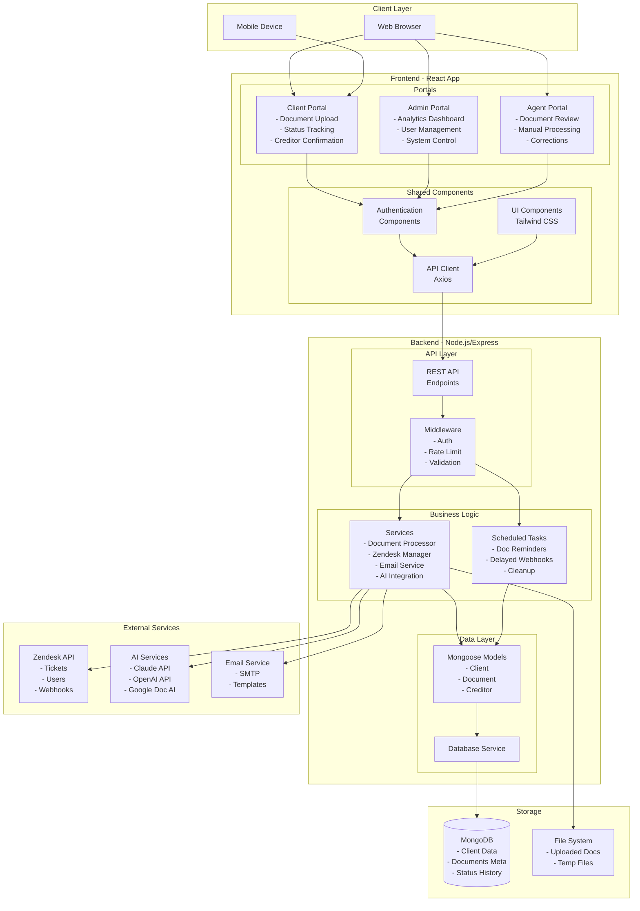
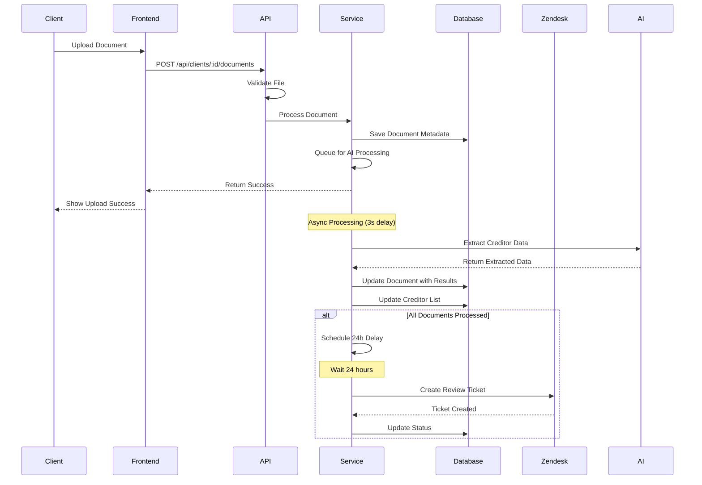
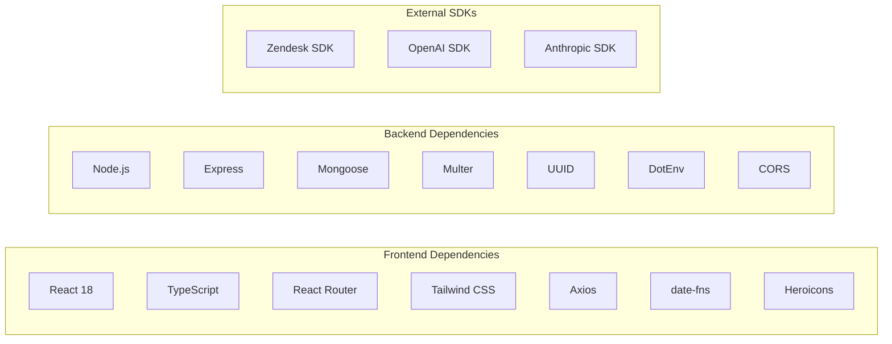
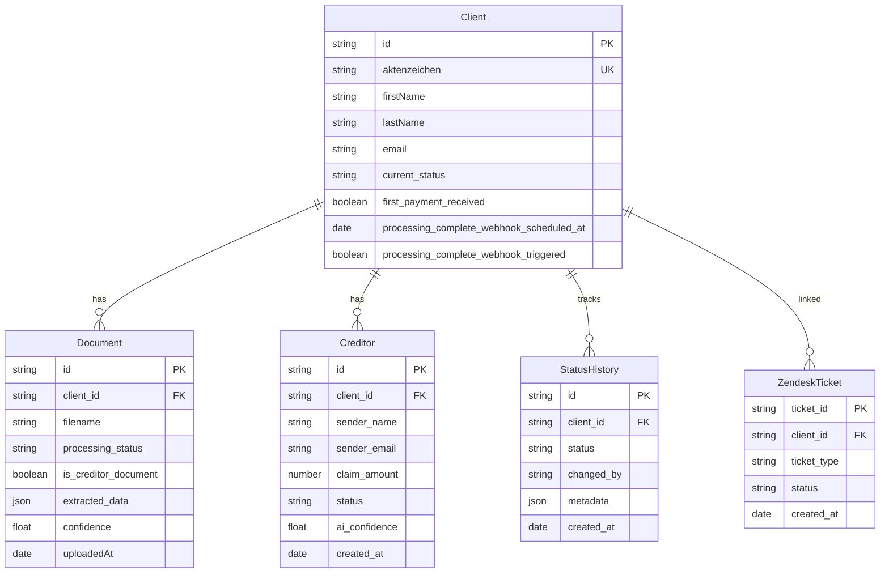
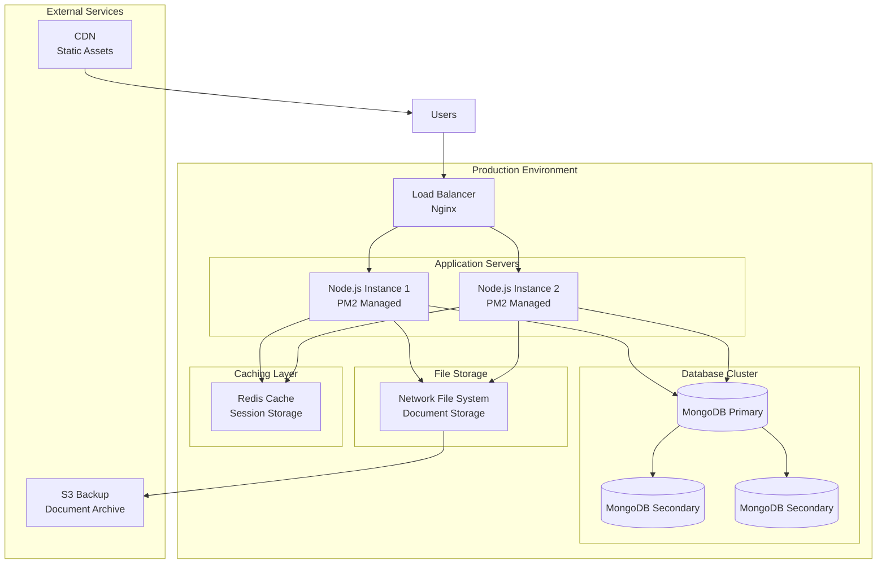

```mermaid
graph TB
    subgraph "Security Layers"
        subgraph "Frontend Security"
            InputVal[Input Validation]
            XSS[XSS Protection]
            HTTPS[HTTPS Only]
        end
        
        subgraph "API Security"
            RateLimit[Rate Limiting]
            AuthMW[Auth Middleware]
            CORS[CORS Policy]
            Validation[Request Validation]
        end
        
        subgraph "Backend Security"
            FileVal[File Validation]
            SQLInj[NoSQL Injection Prevention]
            Secrets[Environment Variables]
            Crypto[Token Generation]
        end
        
        subgraph "Infrastructure"
            Firewall[Firewall Rules]
            SSL[SSL Certificates]
            Backup[Automated Backups]
        end
    end
    
    InputVal --> XSS
    XSS --> HTTPS
    HTTPS --> RateLimit
    RateLimit --> AuthMW
    AuthMW --> CORS
    CORS --> Validation
    Validation --> FileVal
    FileVal --> SQLInj
    SQLInj --> Secrets
    Secrets --> Crypto
    Crypto --> Firewall
    Firewall --> SSL
    SSL --> Backup
```

# System Architecture Diagram

## 🏗️ High-Level Architecture



## 🔄 Request Flow Example



## 📊 Component Dependencies



## 🗂️ Directory Structure

```
mandanten-portal/
├── src/                          # Frontend Source
│   ├── admin/                    # Admin Portal
│   │   ├── components/          # Admin Components
│   │   ├── pages/              # Admin Pages
│   │   └── AdminApp.tsx        # Admin Root
│   ├── agent/                   # Agent Portal
│   │   ├── components/         # Agent Components
│   │   ├── pages/             # Agent Pages
│   │   └── AgentApp.tsx       # Agent Root
│   ├── pages/                  # Client Portal Pages
│   ├── components/             # Shared Components
│   ├── config/                 # Configuration
│   └── App.tsx                # Main App Component
│
├── server/                     # Backend Source
│   ├── models/                # Database Models
│   │   └── Client.js         # Client Schema
│   ├── routes/               # API Routes
│   │   ├── portal-webhooks.js
│   │   ├── zendesk-webhooks.js
│   │   └── admin-delayed-processing.js
│   ├── services/             # Business Logic
│   │   ├── documentProcessor.js
│   │   ├── zendeskService.js
│   │   ├── delayedProcessingService.js
│   │   └── documentReminderService.js
│   ├── middleware/           # Express Middleware
│   ├── uploads/             # File Upload Directory
│   └── server.js           # Main Server File
│
├── public/                 # Static Assets
├── build/                 # Production Build
└── node_modules/         # Dependencies
```

## 🔐 Security Architecture



## 💾 Data Models



## 🚀 Deployment Architecture



## 📈 Performance Considerations

1. **Database Indexing**
   - Compound indexes on frequently queried fields
   - Text indexes for search functionality

2. **Caching Strategy**
   - API response caching for analytics
   - Static asset caching with CDN
   - Database query result caching

3. **Async Processing**
   - Document processing in background
   - Email sending queued
   - Webhook processing non-blocking

4. **Resource Optimization**
   - Image compression for uploads
   - PDF optimization before storage
   - Pagination for large data sets

5. **Monitoring**
   - APM for performance tracking
   - Error tracking with Sentry
   - Log aggregation with ELK stack